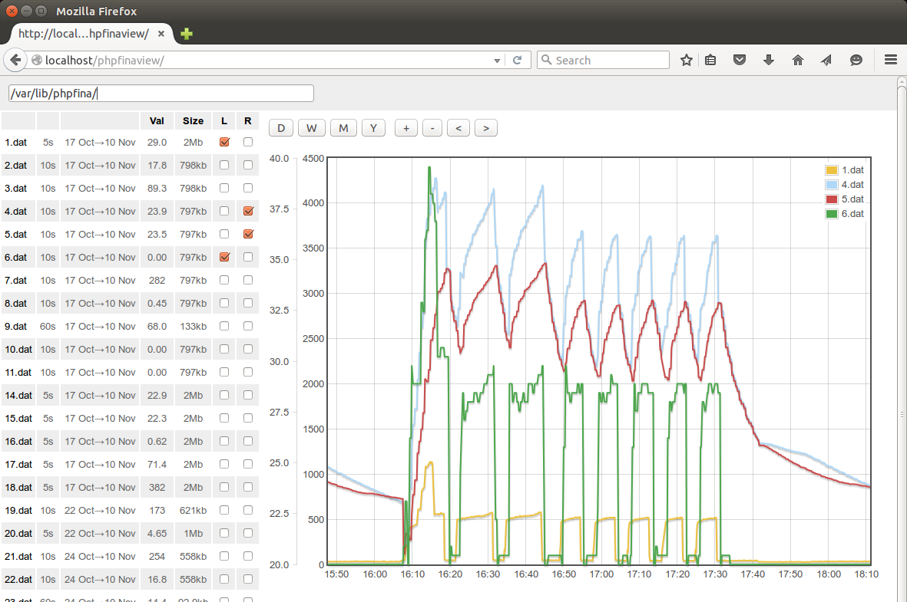

# PHPFina View

Easily explore phpfina timeseries feed engine data files directly without a full emoncms installation.
Useful for checking backup's and archived data.

# Install

Download or git clone this repository into an apache2 server running on the computer on which you store and wish to view your backup or archived data.

On linux the installation steps are:

    sudo apt-get install apache2 php5 libapache2-mod-php5 php5-json
    cd /var/www/
    git clone https://github.com/trystanlea/phpfinaview
    
# Use

Enter the directory where the phpfina data files are stored in the input box and select the feeds you wish to view.

